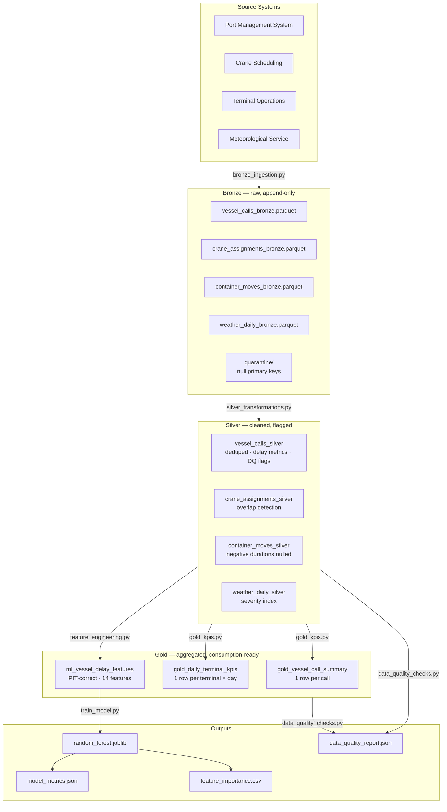

# Port Operations Analytics Lakehouse

A production-style analytics pipeline simulating the data stack a container terminal operations team would build to monitor vessel performance, enforce data quality, and predict arrival delays before a ship reaches port.

The dataset covers five terminals across a 24-month window: 2,000 vessel calls, 7,415 crane assignments, and 94,678 container moves from ten major carriers. The full pipeline — data generation through model training and quality reporting — runs end-to-end in under 60 seconds on a laptop with no external dependencies.

---

## Business Context

Container terminals are capital-intensive facilities where schedule predictability drives everything downstream. A single delayed vessel call ripples outward: cranes miss their windows, yard trucks queue at gates, stack plans collapse, and connecting services on subsequent legs accumulate their own delays. Large container vessels run berth hire costs of $50,000–$100,000 per day; a two-hour delay at a busy terminal can generate tens of thousands of dollars in demurrage exposure before a cargo plan is even adjusted.

This project simulates three analytical questions an operations team needs to answer continuously:

1. **Retrospective** — Where are delays originating, and which terminals or carriers are systematically worse?
2. **Monitoring** — Which records are clean and which have data quality problems requiring investigation?
3. **Pre-arrival prediction** — Given an ETA notification, how likely is this vessel to arrive more than two hours late?

---

## Architecture



---

## Dataset

| Entity | Volume | Notes |
|---|---|---|
| Vessel calls | 2,000 | 24-month window, Jan 2023–Dec 2024 |
| Crane assignments | 7,415 | 2–4 cranes per call |
| Container moves | 94,678 | ~47 moves per call |
| Weather readings | 3,650 | Daily per terminal, seasonal pattern |
| Terminals | 5 | CPT, EFT, NCT, SLH, WIT |
| Carriers | 10 | APL, CMA CGM, COSCO, Evergreen, Hapag-Lloyd, Maersk, MSC, ONE, PIL, ZIM |

The synthetic generator deliberately injects ~4% dirty data — 30 missing ETAs, 10 invalid timestamp sequences, 20 duplicate records, 148 crane time inversions, and 2,796 crane scheduling conflicts — to exercise the full quality framework against realistic operational failure modes.

---

## Repository Structure

```
port-operations-analytics-lakehouse/
├── src/
│   ├── config.py                  # Centralised paths and constants
│   ├── generate_data.py           # Synthetic data generation
│   ├── bronze_ingestion.py        # CSV → Bronze Parquet
│   ├── silver_transformations.py  # Bronze → Silver (clean, flag, enrich)
│   ├── gold_kpis.py               # Silver → Gold KPIs
│   ├── feature_engineering.py     # Silver + Gold → ML feature table
│   ├── train_model.py             # Train, evaluate, and save models
│   └── data_quality_checks.py     # 14-check DQ suite, emit report
├── sql/
│   ├── 01_bronze_to_silver.sql    # Deduplication with QUALIFY
│   ├── 02_gold_terminal_kpis.sql  # GROUPING SETS rollup
│   ├── 03_data_quality_checks.sql # Tukey IQR fence in SQL
│   ├── 04_ml_features.sql         # PIT self-join with LATERAL
│   └── 05_business_analysis_queries.sql
├── tests/
│   ├── conftest.py
│   ├── test_transformations.py    # Unit tests: delay calc, dedup, flags
│   ├── test_features.py           # PIT correctness, leakage prevention
│   └── test_data_quality.py       # Schema contracts, grain uniqueness
├── docs/
│   ├── architecture.md
│   ├── data_model.md
│   ├── ml_approach.md
│   ├── data_quality_rules.md
│   ├── assumptions.md
│   └── interview_talking_points.md
├── diagrams/
│   ├── architecture.md            # Mermaid pipeline flow
│   └── data_model.md              # Mermaid ERD
├── data/                          # Generated at runtime (gitignored)
├── models/                        # Saved sklearn pipelines
└── outputs/                       # JSON/CSV reports
```

---

## Medallion Architecture

### Bronze — Raw ingestion, audit trail

Every source record lands in bronze unchanged, with ingestion metadata stamped on (`_ingestion_ts`, `_batch_id`, `_source_file`). The layer is append-only. Rows with null primary keys are quarantined rather than silently dropped. Bronze is the forensic record: if silver ever produces a wrong answer, replay from bronze to trace it.

### Silver — Cleaned, deduplicated, flagged

Source systems frequently re-transmit corrected records. Silver resolves duplicates using **latest-record-wins** semantics keyed on `record_created_at DESC`. Quality problems — missing ETAs, physically impossible timestamp sequences, crane scheduling conflicts — are marked with boolean flags rather than removed. This **flag-not-drop** philosophy means analysts see the full population including dirty records and can measure the scale of each issue rather than discovering it silently downstream.

Derived metrics computed in silver: `arrival_delay_minutes`, `departure_delay_minutes`, `planned_crane_hours`, `actual_crane_hours`, `productivity_moves_per_hour`, `duration_variance_minutes`.

### Gold — Aggregated, consumption-ready

Two operational tables and one ML feature table. Analytical consumers never need to write joins; gold is optimised for reading. Fan-out risk from one-to-many joins (crane assignments → vessel calls) is pre-empted by pre-aggregating to call grain before joining.

| Table | Grain | Primary use |
|---|---|---|
| `gold_vessel_call_summary` | 1 row per vessel call | Dashboards, delay root-cause analysis |
| `gold_daily_terminal_kpis` | 1 row per terminal × day | Time-series trend reporting |
| `ml_vessel_delay_features` | 1 row per eligible call | Model training and inference |

---

## Data Model

### Silver layer — key tables

**`vessel_calls_silver`** — one row per vessel visit to a terminal. Central fact table.

| Column group | Columns |
|---|---|
| Identity | `vessel_call_id`, `vessel_id`, `vessel_name`, `vessel_class`, `carrier_code` |
| Location | `terminal_id`, `berth_id` |
| Planned schedule | `eta`, `etd`, `planned_turnaround_hours`, `planned_cargo_teu` |
| Actuals | `ata`, `atd`, `actual_turnaround_hours`, `actual_cargo_teu` |
| Derived metrics | `arrival_delay_minutes`, `departure_delay_minutes`, `delay_hours` |
| DQ flags | `missing_eta_flag`, `missing_ata_flag`, `invalid_arrival_sequence_flag`, `large_delay_outlier_flag` |

**`crane_assignments_silver`** — one row per crane serving one vessel call for one continuous window. A vessel typically has 2–4 concurrent crane assignments.

Key columns: `assignment_id`, `vessel_call_id`, `crane_id`, `planned_start/end`, `actual_start/end`, `productivity_moves_per_hour`, `invalid_crane_time_flag`, `crane_overlap_flag`.

**`container_moves_silver`** — one row per individual container loaded or discharged. Highest-volume table at 94,678 rows. Negative `actual_duration_minutes` values are replaced with NULL in silver rather than kept, because downstream averages would be silently wrong.

**`weather_daily_silver`** — one row per terminal per calendar day. `severity_index` (0–1 composite of wind, wave, visibility, precipitation) follows a seasonal pattern: Northern European winters are 1.5× more severe than summer months. Joined to vessel calls on `(terminal_id, date(eta))`.

**`terminal_metadata_silver`** — static reference table, 5 rows.

| Terminal | Name | Max vessel class | Cranes |
|---|---|---|---|
| NCT | Northgate Container Terminal | ULCV | 12 |
| EFT | Eastport Freight Terminal | Post-Panamax | 8 |
| CPT | Central Port Terminal | Panamax | 7 |
| SLH | Southside Logistics Hub | Panamax | 5 |
| WIT | Westquay Industrial Terminal | Sub-Panamax | 4 |

---

## Data Quality Framework

14 checks across four layers, each returning PASS / WARN / FAIL with structured JSON output. The framework follows a **flag-not-drop** philosophy: records are marked, not deleted, so analysts can investigate issues rather than discovering them in production.

| Layer | Check | Threshold | Result |
|---|---|---|---|
| Silver | Duplicate vessel call IDs | > 0 → FAIL | PASS |
| Silver | Missing ETA rate | > 5% → WARN | PASS (1.5%) |
| Silver | Missing ATA rate | > 10% → WARN | PASS (1.0%) |
| Silver | Invalid arrival sequence (ATA > ATD) | > 0 → WARN | **WARN (10 rows)** |
| Silver | Invalid departure sequence (ETD < ETA) | > 0 → WARN | PASS |
| Silver | Large delay outliers (Tukey IQR, 24h floor) | > 1% → WARN | PASS (0.4%) |
| Crane | End before start | > 2% → WARN | PASS (2.0%) |
| Crane | Crane schedule overlaps | > 5% → WARN, > 15% → FAIL | **FAIL (37.7%)** |
| Crane | Orphan assignments (no matching call) | > 0 → FAIL | PASS |
| Gold | Call summary grain (1 row per call) | > 0 dupes → FAIL | PASS |
| Gold | Terminal KPI grain (1 row per terminal × day) | > 0 dupes → FAIL | PASS |
| ML | Feature null rates (static features) | > 5% → FAIL | PASS |
| ML | Target distribution (positive label rate) | < 5% or > 60% → WARN | PASS (26.6%) |
| Cross-layer | Row count reconciliation (gold ≤ silver, ml ≤ silver) | ML > Silver → FAIL | PASS |

The 37.7% crane overlap rate is intentional: it represents a real operational failure mode where crane scheduling data has not been reconciled with actual allocation changes. In production, this rate would trigger an immediate alert. The framework correctly classifies it as FAIL.

The outlier fence uses the **Tukey IQR method** (`Q3 + 1.5×IQR`, minimum 24-hour floor) computed on positive delays only. The same computation is implemented in both `silver_transformations.py` and `sql/03_data_quality_checks.sql` — running both and comparing outputs cross-validates correctness.

---

## SQL Analytics

Five standalone DuckDB SQL files implement the full pipeline in pure SQL, independently of the Python code. Each file is runnable without any server setup; DuckDB reads Parquet natively in-process.

**Senior SQL patterns demonstrated:**

| Pattern | Location |
|---|---|
| `QUALIFY ROW_NUMBER() OVER (...)` for deduplication | `01_bronze_to_silver.sql` |
| `GROUPING SETS` for rollup reporting across terminal and carrier dimensions | `02_gold_terminal_kpis.sql` |
| `RANGE BETWEEN INTERVAL '30 days' PRECEDING AND CURRENT ROW` for rolling averages | `02_gold_terminal_kpis.sql` |
| Tukey IQR outlier fence with conditional aggregation | `03_data_quality_checks.sql` |
| `LATERAL` subquery for correlated PIT aggregation | `04_ml_features.sql` |
| PIT self-join with strict `atd < eta` inequality | `04_ml_features.sql` |

**Business analysis queries** (`05_business_analysis_queries.sql`) answer five operational questions:

1. Is delay performance improving or worsening by terminal over time?
2. How has the distribution of delay root causes shifted quarter-over-quarter?
3. What is the quantified weather penalty — how much worse is throughput on storm days?
4. Which carriers consistently arrive on time, and which are systematically late?
5. Are terminal utilisation rates approaching the threshold where a single disruption cascades?

---

## ML: Vessel Delay Prediction

**Problem:** given an ETA notification for an upcoming vessel call, predict whether the vessel will arrive more than two hours late. The prediction must be made using only information available at notification time — before the vessel arrives.

**Why this is hard to get right:** naive feature computation against a full historical table leaks post-arrival data into the training set. `actual_turnaround_hours`, for example, is only knowable after the vessel has left the berth — using it inflates training metrics while the model fails silently in production.

### Point-in-time correctness

Rolling history features use a cross-merge filtered to `history.atd < current.eta` with a strict inequality:

```python
merged = candidates.merge(history, on="terminal_id", how="left")
merged = merged[
    (merged["_h_atd"] < merged["eta"]) &          # strict: no future data
    (merged["_h_call_id"] != merged["vessel_call_id"])  # exclude self
]
```

Congestion features use only planned times (`eta`, `etd`) from concurrent calls — never actual arrivals. Leakage columns (`ata`, `atd`, `arrival_delay_minutes`, `actual_turnaround_hours`) are excluded via an allowlist in `assemble_feature_table()` and enforced by parametrised pytest assertions.

### Feature set (14 features)

| Group | Features |
|---|---|
| Categorical (encoded) | `terminal_id_encoded`, `service_code_encoded` |
| Static call scope | `vessel_capacity_teu`, `planned_moves`, `planned_crane_count`, `planned_crane_hours` |
| Temporal | `day_of_week`, `month`, `is_weekend` |
| Weather | `storm_flag` |
| Rolling history (PIT) | `avg_previous_10_terminal_delays`, `avg_previous_10_service_delays`, `previous_vessel_delay` |
| Congestion | `terminal_congestion_score` |

### Train / test split

Split **chronologically** — the last 20% of calls by ETA form the test set (post 2024-08-19). A random split would scatter future vessel histories into the training rows of earlier calls, inflating metrics by exactly the mechanism the split is meant to evaluate.

| Set | Rows | Positive rate |
|---|---|---|
| Train | 1,552 | 26.9% |
| Test | 389 | 25.2% |

### Model results

Both models use `class_weight="balanced"` and sklearn Pipelines that bundle imputation with the estimator, ensuring consistent preprocessing at inference time.

| Model | AUC | F1 | Precision | Recall | Accuracy |
|---|---|---|---|---|---|
| Logistic Regression | 0.477 | 0.328 | 0.232 | 0.561 | 0.422 |
| Random Forest | 0.538 | 0.229 | 0.305 | 0.184 | 0.689 |

AUC near 0.5 is expected on this dataset. The synthetic delay variable contains deliberate randomness that the available features cannot explain — this is by design. The project is built to demonstrate the feature engineering infrastructure and PIT correctness guarantees, not to achieve high accuracy on artificial data. On real port operations data, where delays have structural causes (pilot availability, tidal windows, berth queue), these same features produce meaningfully higher AUC.

### Feature importance (top 5 by RF Gini impurity)

| Feature | RF importance | LR coefficient |
|---|---|---|
| `avg_previous_10_service_delays` | 0.133 | +0.101 |
| `vessel_capacity_teu` | 0.132 | +0.046 |
| `avg_previous_10_terminal_delays` | 0.130 | +0.069 |
| `planned_crane_hours` | 0.126 | +0.076 |
| `planned_moves` | 0.104 | +0.016 |

All five have positive coefficients: larger vessels with heavier cargo plans at busier terminals are more likely to be delayed. Operationally intuitive.

---

## Running Locally

```bash
git clone https://github.com/<you>/port-operations-analytics-lakehouse
cd port-operations-analytics-lakehouse

python -m venv .venv && source .venv/bin/activate
pip install -r requirements.txt
```

Run the full pipeline in order:

```bash
python src/generate_data.py          # Generate synthetic CSVs
python src/bronze_ingestion.py       # CSV → Bronze Parquet
python src/silver_transformations.py # Bronze → Silver (clean, flag)
python src/gold_kpis.py              # Silver → Gold KPIs
python src/feature_engineering.py   # Silver + Gold → ML features
python src/train_model.py            # Train models, save metrics
python src/data_quality_checks.py   # Run DQ suite, emit report
pytest tests/ -v                     # 106 tests
```

Each script is independently runnable and reads only from the layer below it. Outputs land in `outputs/` and `models/`.

**Requirements:** Python 3.9+, no external database or cloud services.

---

## Skills Demonstrated

**Data engineering**
- Medallion lakehouse architecture (Bronze / Silver / Gold) with defined layer contracts
- Flag-not-drop quality enforcement with structured JSON reporting
- Latest-record-wins deduplication for source system corrections
- Parquet I/O with PyArrow schema enforcement across pipeline stages

**Analytical SQL**
- DuckDB in-process analytics on Parquet without infrastructure
- Window functions: `QUALIFY`, `RANK`, `LAG`, `cummax`-equivalent patterns
- `GROUPING SETS` for multi-dimensional rollup reporting
- `RANGE BETWEEN INTERVAL` for time-windowed rolling averages
- `LATERAL` correlated subqueries for PIT aggregation

**Machine learning**
- Point-in-time correct feature engineering with strict temporal self-join
- Target leakage prevention enforced at code level (allowlist) and test level (parametrised assertions)
- sklearn Pipelines ensuring identical preprocessing at train and inference time
- Chronological train/test split with leakage analysis
- OrdinalEncoder with fixed category lists for stable cross-run mappings

**Software engineering**
- 106 pytest tests covering schema contracts, flag logic, grain uniqueness, and leakage
- Centralised configuration in `config.py` — no hardcoded paths
- Modular pipeline scripts, each independently runnable
- Production-grade edge case handling (empty groups, tz-aware timestamps, dtype stability)

---

## Interview Talking Points

**30 seconds:** A medallion lakehouse for port operations that tracks 2,000 vessel calls across five terminals, enforces 14 data quality checks, and predicts pre-arrival delays using point-in-time correct features. The pipeline runs end-to-end in under a minute with 106 automated tests.

**2 minutes:** The interesting engineering is in two places. First, the flag-not-drop quality framework: rather than silently removing dirty records, every quality issue gets a boolean flag so analysts can measure the scale of each problem and trace it to its source. The crane overlap rate is 37.7% — that number is visible and actionable, not hidden. Second, the PIT correctness constraint on the ML features: rolling history features are computed using `history.atd < current.eta` with a strict inequality, and leakage columns are excluded via an allowlist enforced by both production code and automated tests. Adding a leakage column breaks CI.

**Key design decisions:**
- Chronological train/test split — a random split would let future vessel histories contaminate training rows through the rolling features
- Allowlist over denylist for feature selection — new columns never accidentally enter the ML table
- `min_samples_leaf=10` in Random Forest — prevents memorising individual vessel quirks on a 1,552-row training set
- `class_weight="balanced"` — delay prediction is an alert system; missing a delay costs more than a false alarm

See `docs/interview_talking_points.md` for deep-dive technical Q&A and Nordic maritime employer context (Maersk, DSV, DFDS, Port of Aarhus).

---

## Future Improvements

**Infrastructure**
- Port to Spark/Delta Lake or Databricks — the medallion contracts and PIT join patterns translate directly; only the execution engine changes
- Airflow or Prefect DAGs to replace sequential script execution with dependency-aware scheduling
- Streaming ingestion triggered by AIS vessel tracking messages for real-time ETA prediction

**Modelling**
- Cross-validated hyperparameter search for the Random Forest (learning rate, max depth, n_estimators)
- Gradient boosted trees (XGBoost or LightGBM) as a stronger ensemble baseline
- Decision threshold calibration against operational cost matrix — a 0.3 threshold favouring recall is likely more appropriate for an alert system than the default 0.5
- Population stability index (PSI) monitoring on rolling history features to detect when retraining is warranted

**Analytics**
- Berth utilisation heatmap by terminal and time of day
- Carrier reliability scorecard with confidence intervals
- Demurrage exposure estimation by delay root cause

---

## License

MIT
