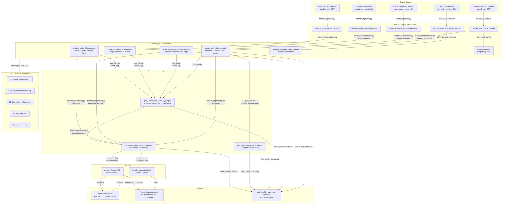
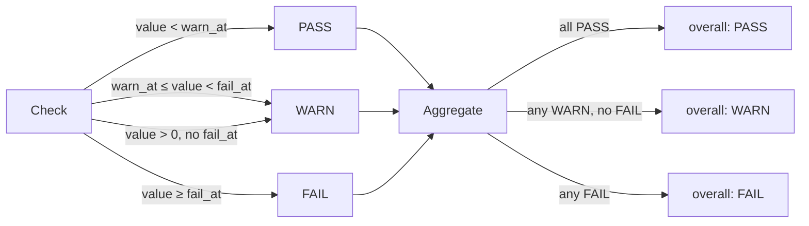
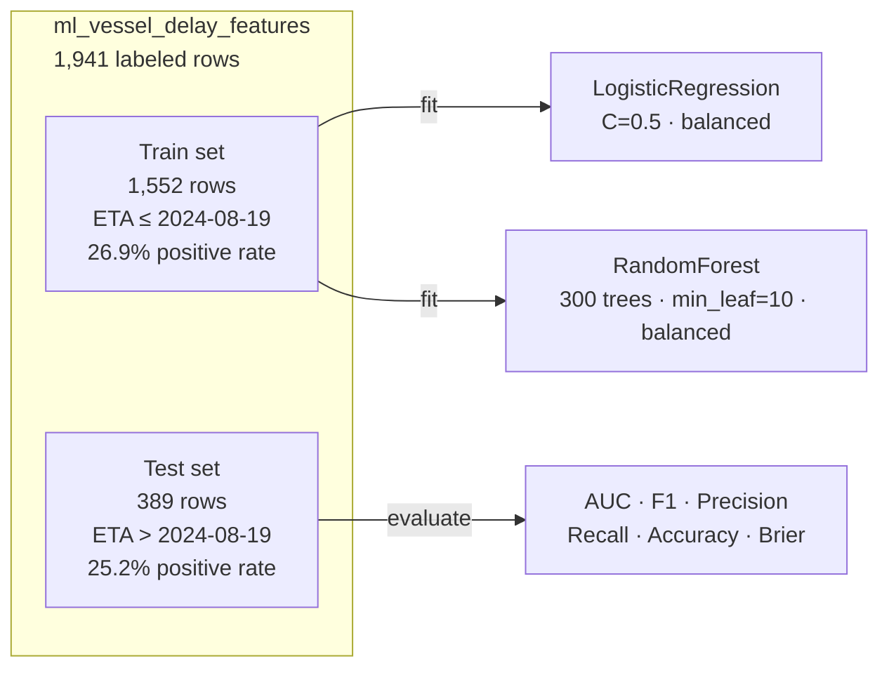

# Architecture Diagram

## Pipeline Data Flow

```mermaid
flowchart TD
    subgraph Sources["Source Systems"]
        S1[Port Management System\nvessel_calls CSV]
        S2[Crane Scheduling System\ncrane_assignments CSV]
        S3[Terminal Operations\ncontainer_moves CSV]
        S4[Meteorological Service\nweather_daily CSV]
        S5[Terminal Registry\nterminal_metadata CSV]
    end

    subgraph Bronze["Bronze Layer — data/bronze/"]
        B1[vessel_calls_bronze.parquet]
        B2[crane_assignments_bronze.parquet]
        B3[container_moves_bronze.parquet]
        B4[weather_daily_bronze.parquet]
        B5[terminal_metadata_bronze.parquet]
        BQ[data/quarantine/\nnull primary keys]
    end

    subgraph Silver["Silver Layer — data/silver/"]
        SV1[vessel_calls_silver.parquet\ndeduped · flagged · delay metrics]
        SV2[crane_assignments_silver.parquet\noverlap detection · time flags]
        SV3[container_moves_silver.parquet\nnegative durations nulled]
        SV4[weather_daily_silver.parquet\nseverity index · impact factor]
        SV5[terminal_metadata_silver.parquet\ncapacity constraints]
    end

    subgraph Gold["Gold Layer — data/gold/"]
        G1[gold_vessel_call_summary.parquet\n1 row per vessel call · KPIs joined]
        G2[gold_daily_terminal_kpis.parquet\n1 row per terminal × day]
        G3[ml_vessel_delay_features.parquet\nPIT-correct · 14 features]
    end

    subgraph Models["models/"]
        M1[logistic_regression.joblib\nsklearn Pipeline]
        M2[random_forest.joblib\nsklearn Pipeline]
    end

    subgraph Outputs["outputs/"]
        O1[model_metrics.json\nAUC · F1 · precision · recall]
        O2[feature_importance.csv\nRF importance · LR coefficients]
        O3[data_quality_report.json\n14 checks · PASS/WARN/FAIL]
    end

    subgraph SQL["sql/ — DuckDB showcase"]
        Q1[01_bronze_ingestion.sql]
        Q2[02_silver_transformations.sql]
        Q3[03_data_quality_checks.sql]
        Q4[04_gold_kpis.sql]
        Q5[05_ml_features.sql]
    end

    S1 -->|bronze_ingestion.py| B1
    S2 -->|bronze_ingestion.py| B2
    S3 -->|bronze_ingestion.py| B3
    S4 -->|bronze_ingestion.py| B4
    S5 -->|bronze_ingestion.py| B5
    B1 -.->|null vessel_call_id| BQ

    B1 -->|silver_transformations.py\ndedup · flag · enrich| SV1
    B2 -->|silver_transformations.py\noverlap detection| SV2
    B3 -->|silver_transformations.py\nclean durations| SV3
    B4 -->|silver_transformations.py| SV4
    B5 -->|silver_transformations.py| SV5

    SV1 -->|gold_kpis.py| G1
    SV2 -->|gold_kpis.py\ncrane agg| G1
    SV3 -->|gold_kpis.py\nmove agg| G1
    SV4 -->|gold_kpis.py\nstorm flag| G1
    SV1 -->|gold_kpis.py\ngroupby terminal+date| G2
    SV1 -->|feature_engineering.py\nPIT self-join| G3
    SV2 -->|feature_engineering.py\nplanned crane hours| G3
    SV4 -->|feature_engineering.py\nstorm flag| G3
    G1 -->|feature_engineering.py\ncongestion score| G3

    G3 -->|train_model.py\ntime-based split| M1
    G3 -->|train_model.py\ntime-based split| M2
    M1 -->|evaluate| O1
    M2 -->|evaluate| O1
    M1 -->|coef\_| O2
    M2 -->|feature\_importances\_| O2

    SV1 -->|data_quality_checks.py| O3
    SV2 -->|data_quality_checks.py| O3
    G1 -->|data_quality_checks.py| O3
    G2 -->|data_quality_checks.py| O3
    G3 -->|data_quality_checks.py| O3

    Silver -.->|same logic, pure SQL| SQL
```

---

## DQ Check Status Flow

```mermaid
flowchart LR
    Check -->|value < warn_at| PASS
    Check -->|warn_at ≤ value < fail_at| WARN
    Check -->|value ≥ fail_at| FAIL
    Check -->|value > 0, no fail_at| WARN

    PASS --> Aggregate
    WARN --> Aggregate
    FAIL --> Aggregate

    Aggregate -->|all PASS| overall_PASS[overall: PASS]
    Aggregate -->|any WARN, no FAIL| overall_WARN[overall: WARN]
    Aggregate -->|any FAIL| overall_FAIL[overall: FAIL]
```

---

## Train / Inference Split

```mermaid
flowchart LR
    subgraph Features["ml_vessel_delay_features\n1,941 labeled rows"]
        Train["Train set\n1,552 rows\nETA ≤ 2024-08-19\n26.9% positive rate"]
        Test["Test set\n389 rows\nETA > 2024-08-19\n25.2% positive rate"]
    end

    Train -->|fit| LR[LogisticRegression\nC=0.5 · balanced]
    Train -->|fit| RF[RandomForest\n300 trees · min_leaf=10 · balanced]
    Test -->|evaluate| Metrics[AUC · F1 · Precision\nRecall · Accuracy · Brier]
```
