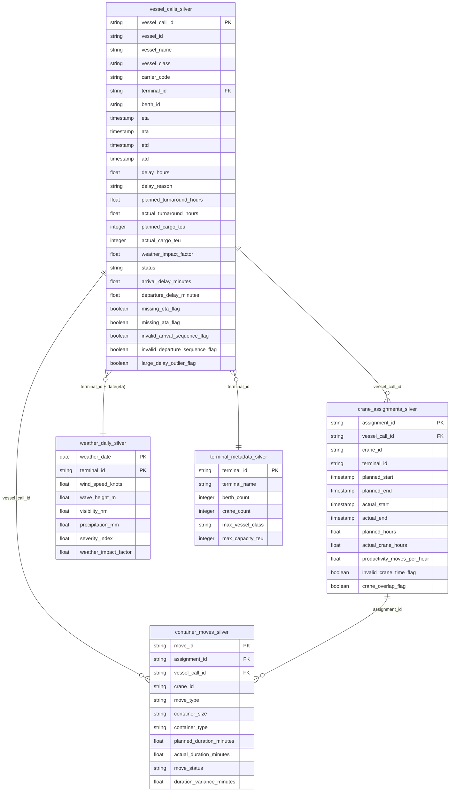
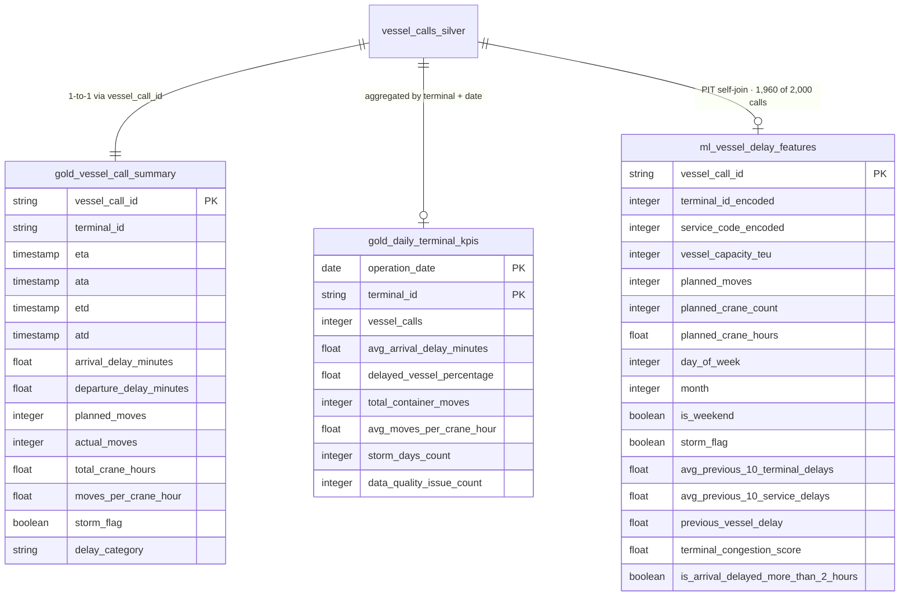
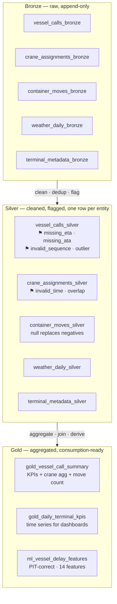
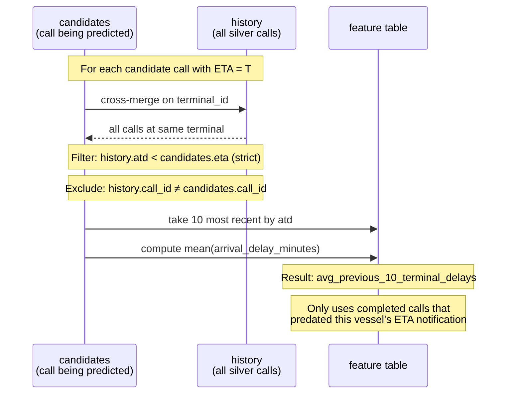

# Data Model Diagram

## Entity Relationship Diagram (Silver Layer)

```mermaid
erDiagram
    vessel_calls_silver {
        string vessel_call_id PK
        string vessel_id
        string vessel_name
        string vessel_class
        string carrier_code
        string terminal_id FK
        string berth_id
        timestamp eta
        timestamp ata
        timestamp etd
        timestamp atd
        float delay_hours
        string delay_reason
        float planned_turnaround_hours
        float actual_turnaround_hours
        integer planned_cargo_teu
        integer actual_cargo_teu
        float weather_impact_factor
        string status
        float arrival_delay_minutes
        float departure_delay_minutes
        boolean missing_eta_flag
        boolean missing_ata_flag
        boolean invalid_arrival_sequence_flag
        boolean invalid_departure_sequence_flag
        boolean large_delay_outlier_flag
    }

    crane_assignments_silver {
        string assignment_id PK
        string vessel_call_id FK
        string crane_id
        string terminal_id
        timestamp planned_start
        timestamp planned_end
        timestamp actual_start
        timestamp actual_end
        float planned_hours
        float actual_crane_hours
        float productivity_moves_per_hour
        boolean invalid_crane_time_flag
        boolean crane_overlap_flag
    }

    container_moves_silver {
        string move_id PK
        string assignment_id FK
        string vessel_call_id FK
        string crane_id
        string move_type
        string container_size
        string container_type
        float planned_duration_minutes
        float actual_duration_minutes
        string move_status
        float duration_variance_minutes
    }

    weather_daily_silver {
        date weather_date PK
        string terminal_id PK
        float wind_speed_knots
        float wave_height_m
        float visibility_nm
        float precipitation_mm
        float severity_index
        float weather_impact_factor
    }

    terminal_metadata_silver {
        string terminal_id PK
        string terminal_name
        integer berth_count
        integer crane_count
        string max_vessel_class
        integer max_capacity_teu
    }

    vessel_calls_silver ||--o{ crane_assignments_silver : "vessel_call_id"
    vessel_calls_silver ||--o{ container_moves_silver : "vessel_call_id"
    crane_assignments_silver ||--o{ container_moves_silver : "assignment_id"
    vessel_calls_silver }o--|| terminal_metadata_silver : "terminal_id"
    vessel_calls_silver }o--|| weather_daily_silver : "terminal_id + date(eta)"
```

---

## Gold Layer Derivation

```mermaid
erDiagram
    gold_vessel_call_summary {
        string vessel_call_id PK
        string terminal_id
        timestamp eta
        timestamp ata
        timestamp etd
        timestamp atd
        float arrival_delay_minutes
        float departure_delay_minutes
        integer planned_moves
        integer actual_moves
        float total_crane_hours
        float moves_per_crane_hour
        boolean storm_flag
        string delay_category
    }

    gold_daily_terminal_kpis {
        date operation_date PK
        string terminal_id PK
        integer vessel_calls
        float avg_arrival_delay_minutes
        float delayed_vessel_percentage
        integer total_container_moves
        float avg_moves_per_crane_hour
        integer storm_days_count
        integer data_quality_issue_count
    }

    ml_vessel_delay_features {
        string vessel_call_id PK
        integer terminal_id_encoded
        integer service_code_encoded
        integer vessel_capacity_teu
        integer planned_moves
        integer planned_crane_count
        float planned_crane_hours
        integer day_of_week
        integer month
        boolean is_weekend
        boolean storm_flag
        float avg_previous_10_terminal_delays
        float avg_previous_10_service_delays
        float previous_vessel_delay
        float terminal_congestion_score
        boolean is_arrival_delayed_more_than_2_hours
    }

    vessel_calls_silver ||--|| gold_vessel_call_summary : "1-to-1 via vessel_call_id"
    vessel_calls_silver ||--o| gold_daily_terminal_kpis : "aggregated by terminal + date"
    vessel_calls_silver ||--o| ml_vessel_delay_features : "PIT self-join · 1,960 of 2,000 calls"
```

---

## Medallion Layer Summary

```mermaid
flowchart TB
    subgraph Bronze["Bronze — raw, append-only"]
        direction LR
        b1[vessel_calls_bronze]
        b2[crane_assignments_bronze]
        b3[container_moves_bronze]
        b4[weather_daily_bronze]
        b5[terminal_metadata_bronze]
    end

    subgraph Silver["Silver — cleaned, flagged, one row per entity"]
        direction LR
        s1[vessel_calls_silver\n⚑ missing_eta · missing_ata\n⚑ invalid_sequence · outlier]
        s2[crane_assignments_silver\n⚑ invalid_time · overlap]
        s3[container_moves_silver\nnull replaces negatives]
        s4[weather_daily_silver]
        s5[terminal_metadata_silver]
    end

    subgraph Gold["Gold — aggregated, consumption-ready"]
        direction LR
        g1[gold_vessel_call_summary\nKPIs + crane agg + move count]
        g2[gold_daily_terminal_kpis\ntime series for dashboards]
        g3[ml_vessel_delay_features\nPIT-correct · 14 features]
    end

    Bronze -->|clean · dedup · flag| Silver
    Silver -->|aggregate · join · derive| Gold
```

---

## Point-in-Time Join Pattern (ML Features)

```mermaid
sequenceDiagram
    participant C as candidates<br/>(call being predicted)
    participant H as history<br/>(all silver calls)
    participant F as feature table

    Note over C,H: For each candidate call with ETA = T

    C->>H: cross-merge on terminal_id
    H-->>C: all calls at same terminal

    Note over C,H: Filter: history.atd < candidates.eta (strict)
    Note over C,H: Exclude: history.call_id ≠ candidates.call_id

    C->>F: take 10 most recent by atd
    C->>F: compute mean(arrival_delay_minutes)

    Note over F: Result: avg_previous_10_terminal_delays
    Note over F: Only uses completed calls that<br/>predated this vessel's ETA notification
```
